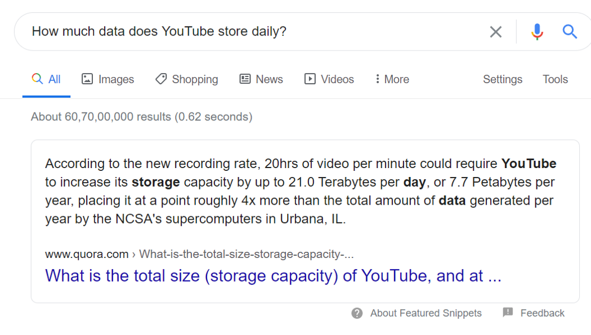

# ***How MNC’s Deals With BIG DATA ? What Solution Have They Found ?***

 

## What is Big Data ?
* Data Collection is the need of almost every organization because data is the thing that runs their business and makes their products or services more efficient.
* But …… What if the organization is unable to store those data. What If the organization is not getting the resources to store the big Terabytes in Petabytes of data.
* Frankly saying there are hardly any storage devices of so much storage available. If by chance the organization decides to buy those they comes with a huge costing
* But is Storing data permanently necessary ? Yes, For this let's consider an example let's say an bank have there customer records of these banking transactions here they have to store these data permanently no matter how huge it is because at the end of the day by that data they are running there organization
* This Problem with the Huge data handling, Managing we collectively call as The BIG DATA PROBLEMS

## Let's Have a look at some of  the Facts
 
 
 
The number of apps downloaded from Google Play Store and App Store every 60 seconds in 2019 jumped to 390,030 from 375,000 only in 2018. 
So by these things it's very much clear how Huge amount of data these organization have to store to run their business 
 

## Is Big Data a single problem ?
* Big Data is a collection of the problem associated with the data
* The three Vs: Volume,  Velocity and  variety. These are the key problems (sub problems ) to understanding	 big data
* Volume: Whenever the organization needs to store some data permanently which is beyond their storage devices storage capacity there the problem of volume arises.
* Velocity: If we By chance have those huge storage  devices satisfying our needs to store data then also we face the issue over the data analysis speed we need to do certain operations over the data. Analyzing data quickly can alert businesses to stocking issues fast so the problem can be solved before it gets worse. Data velocity can also speed up the decision making process to keep up with market changes
* Variety: In addition to volume and velocity, variety is fast becoming a third big data Problem. Variety refers to increase in the diversity of the data

##  What is the Solution to this problem ?
### Distributed storage concept , Yes This concept actually solves the big data problem Wondering How ? Lets see ……

## Distributed storage :
 

Whenever any kind of big data comes and hits the system we can split the data into many set of small data and then pass those data set to the independent working servers / resources

Here in this kind of setup we have a master and slave providing their resources to the master. There can be lots of slaves with a single master to manage a big environment. The data splits and goes to the master node which  then passes those to the slave nodes

If we do such kind of setup we see that we can scale up  the resources according to our need and as the data is split and processed by different machines so the we can perform the operations over the data faster

Thus this have solve the problem of the storage i.e volume as well as the velocity

 

## Conclusion :
So, the products and software that implement the distributed storage concepts can be used to solve the big data problem

Products like : Hadoop, Cassandra ,MongoDB and many more Can be used 

